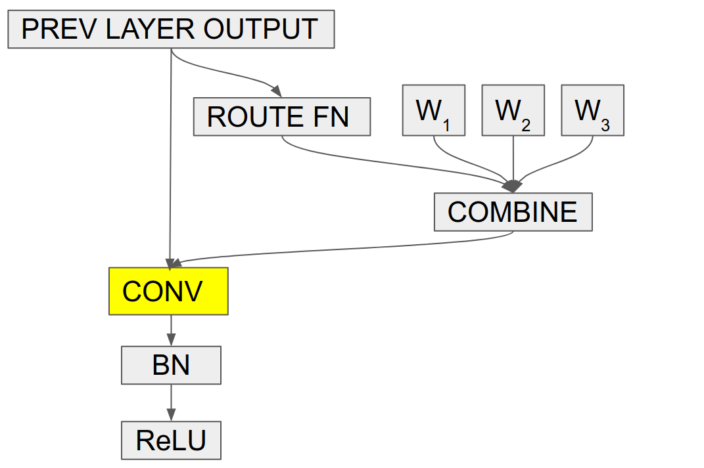

# EfficientNet
EfficientNets是一种新的模型缩放方法，已经是当前的SOTA。[论文](https://arxiv.org/abs/1905.11946)基于深度(depth)，宽度(width)，输入图片分辨率(resolution)的复合缩放方法开发EfficientNets。在高精度状态下，EfficientNet-B7在具有66M参数和37B FLOPS的ImageNet上达到了最先进的84.4％`top-1`/97.1％`top-5`精度。与广泛使用的[ResNet-50](https://arxiv.org/abs/1512.03385)相比，在类似的FLOPS约束下，EfficientNet-B4将`top-1`的准确性从ResNet-50的76.3％提高到82.6％(+6.3％)。

## 知乎问答
EfficientNet-B0是用[MnasNet](https://arxiv.org/abs/1807.11626)的方法搜出来的，利用这个作为基线来复合调整深度、宽度以及分辨率的效果明显要比[ResNet-50](https://arxiv.org/abs/1512.03385)或者MobileNetV2要好，由此可见强化学习搜出来的网络架构上限可能更高！可以看看EfficientNet-B0的网络结构，就会发现和我们手工设计的网络有明显的几处区别：

* 在最开始降采样没有采用maxpooling，而是换成了`stride=2`的conv
* 降采样后的特征图尺寸减半，但是channel没有扩大两倍`stage:6`
* 第一次降采样后的channel反而减少了`stage:1`
* 有很多stage都采用了`5x5`的conv

这是因为对于depthwise separable conv来说，`5x5`的计算量要比两个`3x3`的计算量要小：

```
$$
\begin{aligned}
& Flops(5 \times 5) = H * W * M * (5 * 5 * 1 + 1 * 1 * N) \\
& Flops(3 \times 3) = H * W * M * (3 * 3 * 1 + 1 * 1 * N)
\end{aligned}
$$
```


其中输入特征图尺寸为`(H,W,M)`，输出特征图尺寸为`(H,W,N)`。当`N>7`时，`Flops(5x5)`小于两个`Flops(3x3)`。

## CondConv
条件参数化卷积(CondConv)是卷积神经网络的新构建块，可在保持有效推理的同时提高容量。在传统的卷积层中，每个示例都使用相同的内核进行处理。在CondConv层中，每个示例都使用专门的，依赖于示例的内核进行处理。作为一个直观的激励示例，在ImageNet分类数据集中，我们可能希望对具有不同卷积核的狗和猫进行分类。



一个CondConv层由n个专家组成，每个专家的大小与原始卷积层的卷积核相同。对于每个示例，使用示例相关的路由函数将示例相关的卷积核计算为专家的加权总和。专家数量的增加使我们能够在保持有效推理的同时增加网络的容量。

## 参考资料：
- [github.com/tensorflow/tpu/models/official/efficientnet](https://github.com/tensorflow/tpu/tree/master/models/official/efficientnet)
- [https://github.com/lukemelas/EfficientNet-PyTorch](https://github.com/lukemelas/EfficientNet-PyTorch)
- [https://github.com/rwightman/pytorch-image-models](https://github.com/rwightman/pytorch-image-models)
- [Training EfficientNet-lite on Cloud TPUs](https://cloud.google.com/tpu/docs/tutorials/efficientnet)
